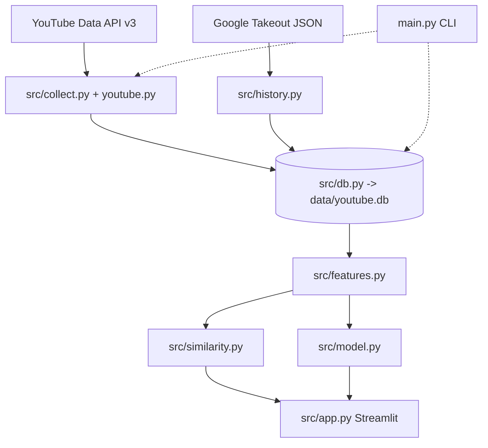

# YouTube Video Similarity & Watch-Likelihood Prediction

> Work in progress. Sections to fill in as you build: Problem → Approach → Data → Methods → Results → Limitations → Future work.

## Architecture
Full diagram: [docs/c4_model.pdf](docs/c4_model.pdf) (C4 levels 1-4: context, containers, components, data flow)



Implemented so far: `youtube`, `collect`, `db`, `quality`. The rest are placeholders for Weeks 3-5.

## Setup
```bash
python -m venv .venv && source .venv/bin/activate   # Windows: .venv\Scripts\activate
pip install -r requirements.txt
cp .env.example .env    # then add your YOUTUBE_API_KEY
```

## Usage
```bash
python main.py collect --pages 2
python main.py transcripts
python main.py quality
```

## Privacy
Personal watch history (Google Takeout) stays in `data/` and is gitignored. Never commit it.
